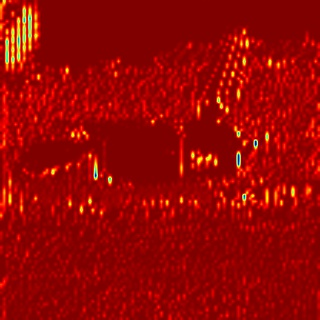
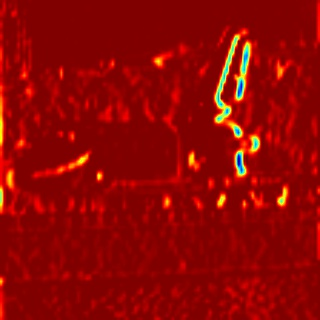
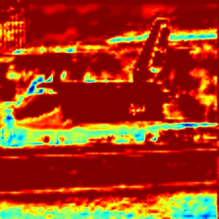

# Presentation
A tutorial to visualize in C++ with OpenCV the deep learning blobs generated with the OpenCV dnn module.
This is an increment of (https://github.com/Pandinosaurus/visualizeDnnBlobs). The new code now uses the recently added dnn::imagesFromBlob method.

## Purpose :
An easy way to visualize the output blobs of each layer of a Deep Convolutional Neural Network with OpenCV.(https://github.com/opencv/opencv).

## What :
The dnn::imagesFromBlob method from the dnn module in OpenCV allows you to retrieve the images contained in a blob so that you can use them with OpenCV like you have the habit to do.
However, you may need some more steps to use this method for visualization.
This example demonstrates how to use the dnn::imagesFromBlob method for visualization purpose.
In a nutshell, we are going to:
1) Load a trained DCNN
2) Load one or multiple images
3) Put the image in a blob
4) Retrieve the image from the blob
6) Run a forward pass on the blob and display the output of each filter on each layer of the network 

## Requirements :
### Compile :
  	- CMake (>= 2.8)
### Libraries :
	- OpenCV (>= 3.4)
### OS:
	- Windows 10 with Visual Studio 2017 (you may need to change the relative paths on Unix, check cmake list and code!)
### Data :
	- The /data/ folder provides you with almost everything you need to get started but the trained model (bvlc_googlenet.caffemodel). 
	You can download it from : https://github.com/BVLC/caffe/tree/master/models/bvlc_googlenet.
	Once downloaded, put it in the /data/ folder.

